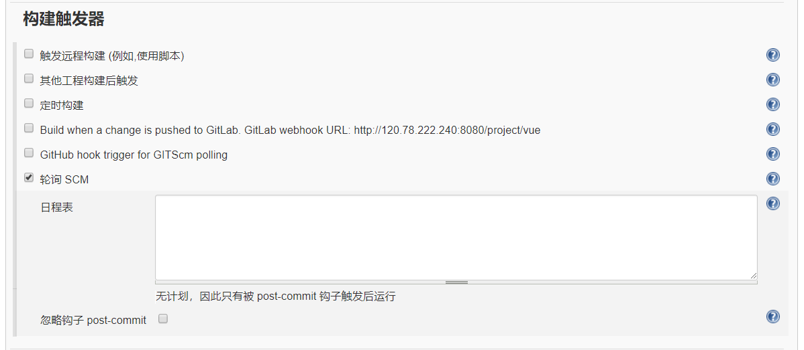

### 导语

公司现有的发版模式，对前端甚不友好，未构建前端自动化打包流程。

### 现状

三种前端发版模式

一、依赖于后端 public 目录，前端完全附属于后端项目。
|-- pulic 后端静态目录
|---- src 源码目录
|---- build 实际打包之后代码
|---- ....

优点
后端程序能在一个项目里又写前端又写后端???

缺点
1、前后端需一起发版，前后开发不能完全解耦。
2、前端源码目录不需要同步到服务器，浪费额外的空间。

二、前端独立建项目，本地打包，上传 build 文件。在通过修改 nginx 配置或代理虚拟目录

优点
前后端独立发版。

缺点
需要本地打包，并新建目录或项目同步至服务器，手动过程。

三、同步整个文件至服务器，服务器打包，删除无用文件。

优点
发版只关注文件是否同步

缺点
1、目标服需配备前端打包环境，node、npm、node_modules 等。非 runtime 的 node_modules 不需要存在。
2、需在服务器上手动操作，即使写为 shell 脚本。

而 jenkins 就改善了前端发版。jenkins 不是一款为前端而生的工具，java、app 等打包程序都可以使用。

### 环境搭建

笔者采用 centos 7.2 64 位系统

#### 安装 jenkins

jenkins 依赖 java
查看 yum 源 java 列表

```
sudo yum list java*
```

这里我们安装 java8（jenkins 需安装 8 以上版本）

```
sudo yum install  java-1.8.0-openjdk
// 查看是否安装成功
java -version
```

安装 jenkins（之所以用 yum 安装，可直接注册服务，而不用每次启动 jar 程序）

```
// 添加jenkins源
sudo wget -O /etc/yum.repos.d/jenkins.repo http://jenkins-ci.org/redhat/jenkins.repo
// 注册rpm
sudo rpm --import http://pkg.jenkins-ci.org/redhat/jenkins-ci.org.key
// 安装
sudo yum install jenkins
```

端口修改

```
vim /etc/sysconfig/jenkins
// 默认未8080，被占用时，可修改
JENKINS_PORT='8080'
// 重启
service jenkins restart
// 关闭
service jenkins stop
// 开启
service jenkins start
```

浏览器访问 ip+端口，之后傻瓜式操作，注册用户，插件使用默认推荐插件。
这时候将看到

使用刚才注册的用户登陆

安装完成

#### 安装 gitlab

gitlab 为非必要条件，github 同样可触发 webhooks。
安装 gitlab
官网：https://about.gitlab.com/installation/#centos-7
参照官网命令
配置

```
// 注意设置访问地址
sudo EXTERNAL_URL=\"${port or ip}\" yum install -y gitlab-ee
// 也可在之后的配置文件中修改
vim /etc/gitlab/gitlab.rb
EXTERNAL_URL=xxx.xxx.xxx.xxx
// 默认为8080，若占用需要修改端口，否则会导致500错误
unicorn['port']=8080
// 配置生效(该过程或许会很漫长)
service gitlab-ctl reconfigure
// 重启
service gitlab-ctl restart
```

浏览器范访问
502！
百思不得解，谷歌上各种配置修改都没用。最后发现时内存不够，阿里云入门机只有 2G 的内存。

万能的 linux 提供了 swap 分区，但是阿里云装机时不能不配置 swap 分区，需手动在 shell 中配置。

```
// 创建swap分区，设置一个8G的swap分区
mkdir /data
dd if=/dev/zero of=/data/swap bs=1073742000 count=8
// 修改内核参数，当使用率超过60%，使用swap交换空间
vim /etc/sysctl.conf
vm.swappiness=60
// 使配置生效
sysctl -p
// 启动swap分区
swapon /data/swap
```

访问浏览器

注册账号，gitlab 安装完成。

### 集成配置

gitlab 创建一个项目名为 vue，本地 git push 代码。

一个 vue-cli 创建的前端项目
setting => Access Tokens =>Create pression access token => copy token
创建一个全局的权限 token，Express at 过期时间可以忽略不设。保留该 token，退出该页面后不可再查看。

项目触发器设置
URL 设为 http://${ip}/gitlab/build_send/${project}， project 为 jenkins 创建项目。在每次分支发送 push 时，触发钩子，发送请求于 jenkins。


#### jenkins 配置

系统管理 => 插件管理 => 可选插件

安装 gitlab plugin，nodejs plugin， pulish over ssh，ssh plugin


#### gitlab 配置

系统管理 => 系统设置 => Gitlab
host 为 gitlab 的网络地址

add => Gitlab API token => API token => 输入 gitlab 生产的 presonal access token

点击 test Connection

应用 => 保存

#### node 配置

系统管理 => 全局工具配置 => node

也可不使用自动安装，选择全局 node 路径

应用 => 保存

#### ssh 服务器配置

ssh 服务器就是远程部署代码的生产服
查看 jenkins 服务器是否有 ssh 密码

```
cd /root/.ssh
ls -a
id_rsa id_rsa.pub
```

若无，生成 ssh

```
ssh-keygen -c ${email}
```

Passphrase 输入密码的密码，若无设置，则跳过。
path to key 输入 id_rsa 私钥
Hostname 远程 ip
username 用户名 root
remote Directory 远程同步目录


Test Configuration => success => 应用 => 保存

#### 创建项目

新建项目 => 创建一个自由风格的软件项目

general，选择配置的 gitlab

设置源码，可配置用户名密码登陆，或者使用 ssh 连接， 设置 master 分支

设置构建触发器，日程表设置为空时，将会被 webhooks 调用

构建环境，选择 node 和 npm 设置

构建配置，选择执行 shell 脚本，注意前端文件较多，压缩处理为 zip 格式

构建后操作，选择 Send build artifacts over SSH，设置远程服务器，注意\$BUILD_ID 为构建 id

保存 => 应用

#### 执行


### <a name=\"github 配置\">github 配置</a>

对于个人仓库而言，还是使用 github 较多，而 github 同样支持 webhook。顺带提及一下。
setting => Develop setting => Personal access tokens => Generate new token => 选择如下配置，同样的这个密钥只出现一次，保存为好


同样的在 jenkins => 系统管理 => 系统设置 => github Server 中输入，API URL 输入官方 api 地址，而非个人仓库


添加密钥 => Secret text => Secret => 输入 github 密钥


jenkins 项目配置
勾选 github project，project url 输入项目地址，不包含.git 后缀


Repository URL 输入 clone 地址，https 后者 ssh 都可以
选择密钥，不再熬述。
选择对应分支。


触发器选择 github hook


ok！当代码提交时，将会自动触发
